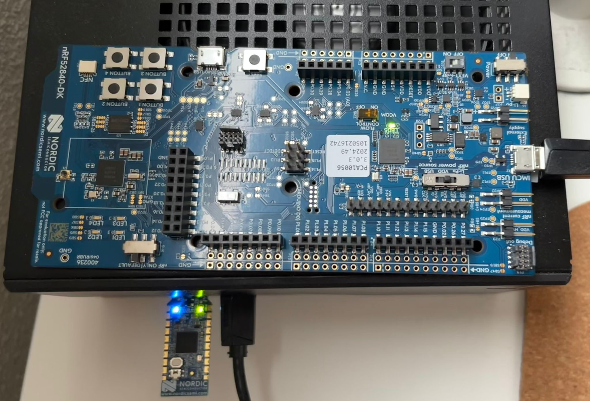

# cubesat-rs

  

The goal of this personal project is developing a demonstrable embedded system simulating a key satellite subsystem (power management), running on an nRF52840 DK, communicating with a Rust-based ground station application via CCSDS-compliant radio messages.
The focus is on the software side of things, not simulation accuracy.

There are two separate sub-projects:
- The embedded software for the nRF52840 DK
- The firmware for the nRF52840 USB Dongle (the "ground station software")

  

## How to use
Coming soon.

## Project status
### CubeSat EPS "simulator" with CCSDS-Compliant Telemetry
##### Fully completed
- [X] Setup project and embedded Rust dev environment
  - [X] Projects structure
  - [X] Launch and debugging scripts 
- [X] Test and pick `ccsds` or `spacepackets` for data transmission

##### In progress
- [ ] Investigate and prototype a simplified CubeSat EPS - Electrical Power System
  - [X] Send mock voltage data
  - [ ] Create EPS module  
- [X] Test basic data transmission and reception
  - [X] Telemetry send and receive (TM, downlink)

### Dongle "Ground station"
##### Fully completed
- [X] Testing visualization libraries
  - [X] Visualize the satellite's orbit with `kiss3d`
  - [X] Visualize telemetry with `plotters`

##### In progress
- [ ] Modify nRF52840 Dongle's original firmware

